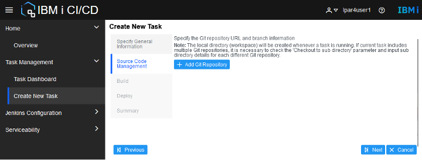
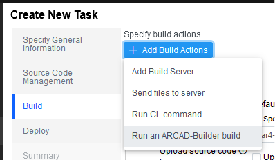

## CI/CD

<!-- panels:start -->

<!-- div:left-panel -->

From `Home>Overview` on the Merlin dashboard, launch the `IBM i CI/CD` application

<!-- div:right-panel -->

<!-- panels:end -->

---

<!-- panels:start -->

<!-- div:left-panel -->

From `Task Management>Create New Task` tab, enter a job name, e.g. `User1_job`.  Click `Next`:

<!-- div:right-panel -->

<!-- panels:end -->

---

<!-- panels:start -->

<!-- div:left-panel -->

Click `Next` (no git repository needs to be specified)

<!-- div:right-panel -->

<!-- panels:end -->

---

<!-- panels:start -->

<!-- div:left-panel -->

Click `Add Build Actions>Add Build Server`

<!-- div:right-panel -->

<!-- panels:end -->

---

<!-- panels:start -->

<!-- div:left-panel -->

Uncheck `Upload source code`.  Check `Select build server (template)` and choose the existing build server

<!-- div:right-panel -->

<!-- panels:end -->

---

<!-- panels:start -->

<!-- div:left-panel -->

Click `Add Build Actions>Run an ARCAD-Builder build`

<!-- div:right-panel -->

<!-- panels:end -->

---

<!-- panels:start -->

<!-- div:left-panel -->

Uncheck `Upload source code`.  Check `Select build server (template)` and choose the existing template

<!-- div:right-panel -->

<!-- panels:end -->

---

<!-- panels:start -->

<!-- div:left-panel -->

Configure the `Run an ARCAD-Builder build` then click `Next`.

<!-- div:right-panel -->

<!-- panels:end -->

---

<!-- panels:start -->

<!-- div:left-panel -->

No Deploy actions are required.  Click `Next`

<!-- div:right-panel -->

<!-- panels:end -->

---

<!-- panels:start -->

<!-- div:left-panel -->

Review the summary and click `Finish`

<!-- div:right-panel -->

<!-- panels:end -->

---

<!-- panels:start -->

<!-- div:left-panel -->

Click `Yes` to save the task

<!-- div:right-panel -->

<!-- panels:end -->

---

<!-- panels:start -->

<!-- div:left-panel -->

Under `Task Management>Task Dashboard`, select `Run Task` from the popup menu on the new task

<!-- div:right-panel -->

<!-- panels:end -->

---

<!-- panels:start -->

<!-- div:left-panel -->

Click `Next` on eash panel and update any values if desired.

<!-- div:right-panel -->

<!-- panels:end -->

---

<!-- panels:start -->

<!-- div:left-panel -->

Click `Finish` to submit the job

<!-- div:right-panel -->

<!-- panels:end -->

---

<!-- panels:start -->

<!-- div:left-panel -->

Click `Yes`

<!-- div:right-panel -->

<!-- panels:end -->

---

<!-- panels:start -->

<!-- div:left-panel -->

The Build results show the final status.  Additional details are provided by checking the Jenkins information

<!-- div:right-panel -->

<!-- panels:end -->

