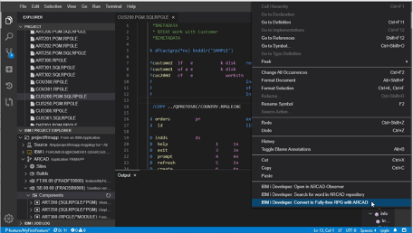
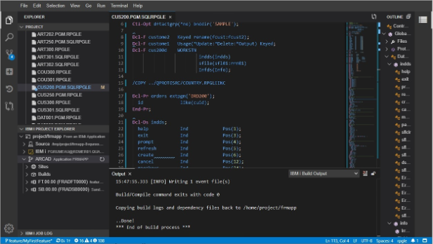

<!-- panels:start -->

<!-- div:left-panel -->

## Convert to fully free RPGLE

* Edit a RPGLE or SQLRPGLE file.  
* Right-click in the editor and select the `IBM i Developer: Convert to Fully-free RPG with ARCAD` option. 
* When completed, the editor is refreshed and the component is automatically recompiled.

<!-- div:right-panel -->

<!-- panels:end -->

---