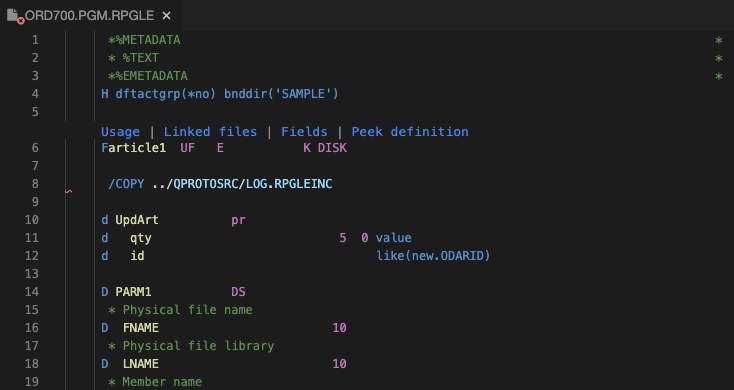

<!-- panels:start -->

<!-- div:left-panel -->

## Convert to fully free RPGLE

* Edit `arcad-example/QRPGLESRC/ORD700.PGM.RPGLE` file.
* The file is using fixed-form RPG for D/C/P specs.  

<!-- div:right-panel -->

<!-- panels:end -->

---

<!-- panels:start -->

<!-- div:left-panel -->

* Right-click `arcad-example/QRPGLESRC/ORD700.PGM.RPGLE` file and select `Transform to Fully-free RPG with ARCAD`

<!-- div:right-panel -->

<!-- panels:end -->

---
<!-- panels:start -->

<!-- div:left-panel -->

* When completed, the component is automatically recompiled and the editor is refreshed with free-form D/C/P specs.
<!-- * The editor contents are updated with free form D/C/P specs
* Right-click in the editor and select the `IBM i Developer: Convert to Fully-free RPG with ARCAD` option.--> 

<!-- div:right-panel -->

<!-- panels:end -->

---