<!-- panels:start -->

<!-- div:left-panel -->

## Debug

* Edit `arcad-example/QRPGLESRC/ORD901.PGM.SQLRPGLE` file. 
* Add pre-compile attribute `* %attr DBGVIEW(*SOURCE)` after metadata block at top of the source to make the program debuggable 

<!-- div:right-panel -->

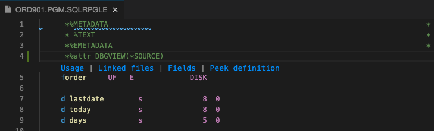

<!-- panels:end -->

---

<!-- panels:start -->

<!-- div:left-panel -->

* Compile the file

<!-- div:right-panel -->

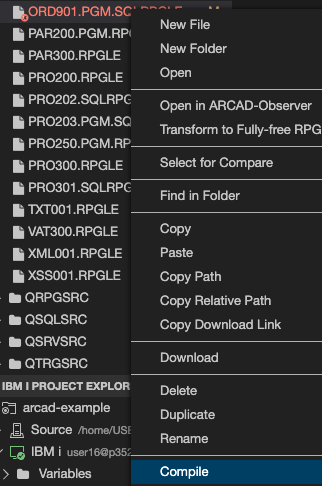

<!-- panels:end -->

---

<!-- panels:start -->

<!-- div:left-panel -->

* In `IBM I Project Explorer`, expand `arcad-example>IBM i>Object Libraries`.
* Expand the library and select the compiled program object 
* Right-click and select `Debug as Batch (Prompt)...` action icon  
* Add `CURLIB(<your library name)` to the end of the command string.  Press Enter

<!-- div:right-panel -->

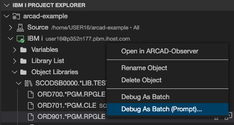
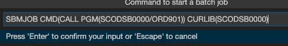

<!-- panels:end -->

---

<!-- panels:start -->

<!-- div:left-panel -->

* The debugger starts with the Debug views (`Debug`, `Threads`, `Call Stack`, `Variables`, `Watch`, and `Breakpoints` on the left).  The editor contains the debuggable source and shows the current line of execution.

<!-- div:right-panel -->

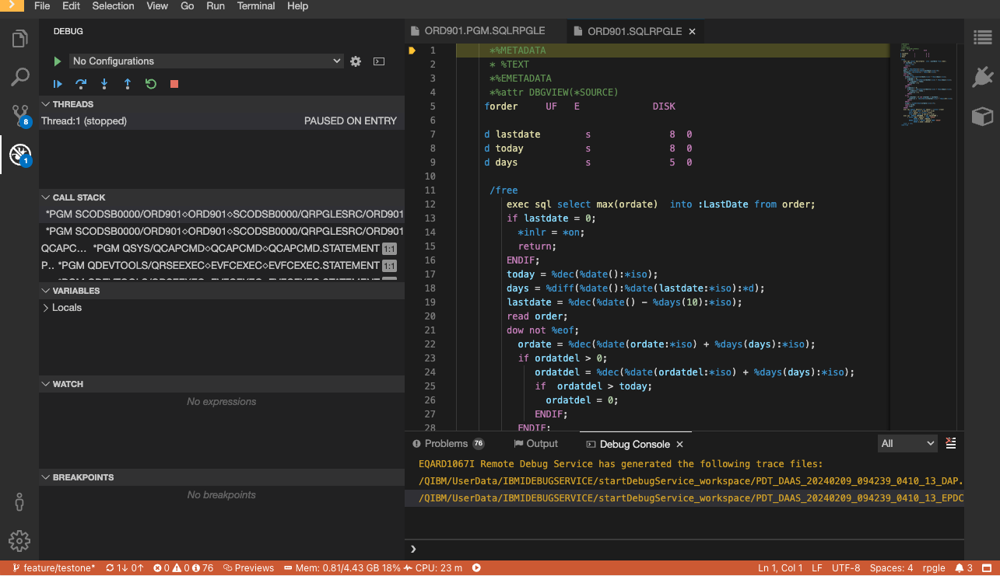

<!-- panels:end -->

---

<!-- panels:start -->

<!-- div:left-panel -->

* The `Debug` view has controls for `Continue`, `Step Over`, `Step Into`, `Step Out`, `Restart` and `Stop`

<!-- div:right-panel -->

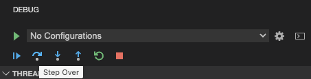

<!-- panels:end -->

---

<!-- panels:start -->

<!-- div:left-panel -->

* The `Variables` view shows the values of variables
* Expand `Locals`

<!-- div:right-panel -->

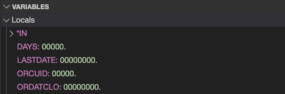

<!-- panels:end -->

---

<!-- panels:start -->

<!-- div:left-panel -->

* In the editor, click on the area to the left of line number `13` to set a breakpoint
* The `Breakpoints` view shows the breakpoint

<!-- div:right-panel -->

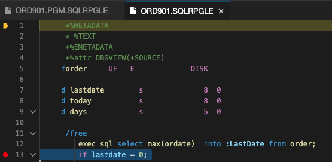
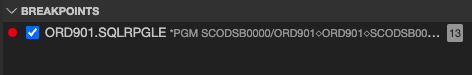

<!-- panels:end -->

---

<!-- panels:start -->

<!-- div:left-panel -->

* In `Debug` view, click `Continue` to have the program run to the breakpoint

<!-- div:right-panel -->

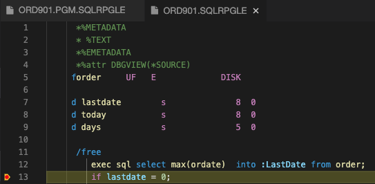

<!-- panels:end -->

---

<!-- panels:start -->

<!-- div:left-panel -->

* In `Variables` view, right-click on `LASTDATE` and select `Set Value`
* Enter `1` and click `OK`
* The value of `LASTDATE` in the `Variables` view is updated

<!-- div:right-panel -->

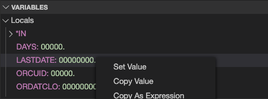
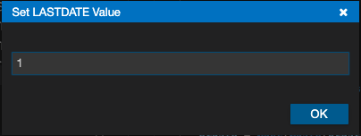

<!-- panels:end -->

---

<!-- panels:start -->

<!-- div:left-panel -->

* In `Debug` view, click `Step Over`
* The line of execution will move to line `16` because the variable value was changed

<!-- div:right-panel -->

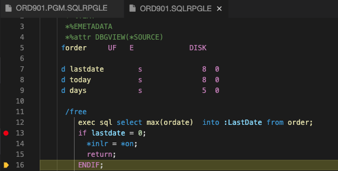

<!-- panels:end -->

---

<!-- panels:start -->

<!-- div:left-panel -->

* In `Debug` view, click `Stop` to end debugging

<!-- div:right-panel -->

<!-- panels:end -->

---

