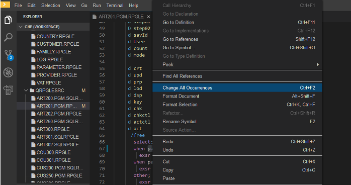

* Green panel: Explorer Panel, file explorer containing  git repository files (source) + other IBM i specific explorers like IBM i Project Explorer, Arcad view, Job Logs…
* Orange panel: central code Panel, where you can visualize and update your source code.
* Red panel:  outline view displays all defined variables, structs and files in active editor
* Blue panel: Problems & Output view, compilation output, warnings, etc.

### ILE RPG has most support

* Outline
* Model created
* Easy navigation
* Hover information
* Showing information from procedure definition
* Procedure call
   * Right click to references
   * See everywhere it’s used
   * And lets you go to those calls
* Collapsible blocks of code

## Features

### Tokenisation

---

<!-- panels:start -->

<!-- div:left-panel -->

### Formatting

* Preferences
   * Determine auto formatting
* Select Code
   * Right click to reformat

<!-- div:right-panel -->

<!-- panels:end -->

---

<!-- panels:start -->

<!-- div:left-panel -->

### Refactoring

* Rename a symbol
  * Intelligent, not just find and replace
  * Updates the model 
* Shift+enter to preview
  * Decide to apply or not
* Model updated after refactoring
  * Show fields

<!-- div:right-panel -->

<!-- panels:end -->

---

<!-- panels:start -->

<!-- div:left-panel -->

### SQL

* Tokenization
* Formatting
* Code collapse
* Embedded SQL

<!-- div:right-panel -->

<!-- panels:end -->

---

<!-- panels:start -->

<!-- div:left-panel -->

Press F1, then type “IBM” to see the IBM i functions available: 

* Compile (single opened file), 
* Build (all), 
* Arcad Build, 
* Convert to Free, 
* Observer, 
* etc

<!-- div:right-panel -->

<!-- panels:end -->

---

<!-- panels:start -->

<!-- div:left-panel -->

### Fast open

Using Control/Command + P to filter workspace files.

<!-- div:right-panel -->

<!-- panels:end -->

---