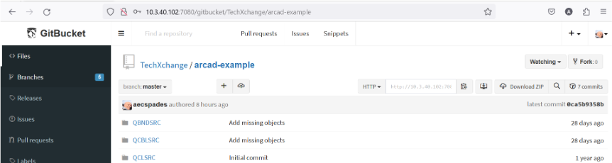
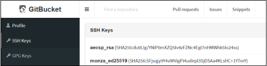
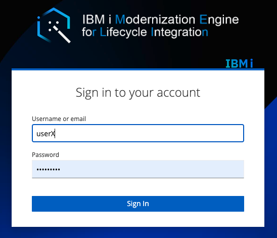
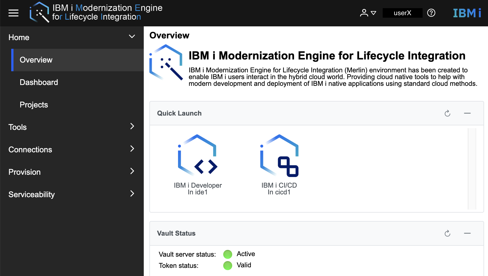
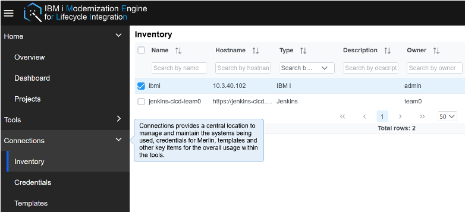
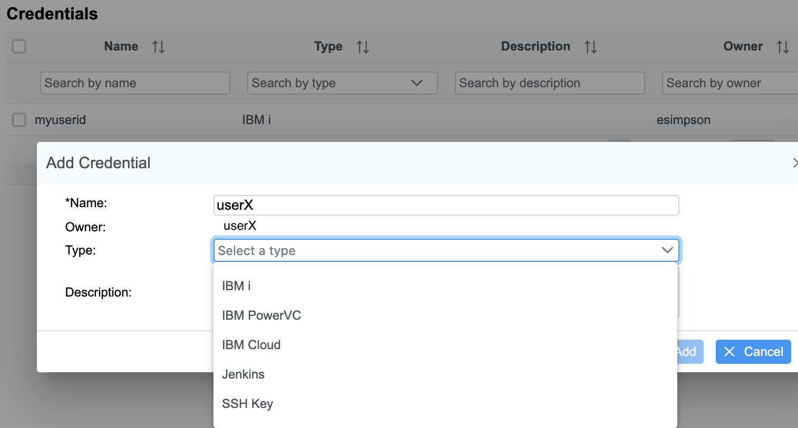
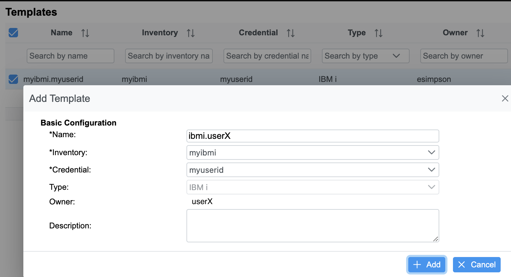
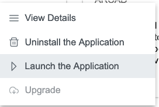

<!--## Preparation: Developer Authentication (SSH)

Result: Source files migrated to git

-->
## Connection to Merlin & Platform overview 

<!-- panels:start -->

<!-- div:left-panel -->

Verify the following information has been provided to you:
* URL to Merlin landing page
* URL to Git repository
* Merlin userid and password

<!-- div:right-panel -->

Proceed to the Merlin landing page URL.

Before accessing any of the Merlin components, you need to ensure your system has the correct browser certificates installed, **otherwise Merlin will not load**.

* See the [Documentation](./guides/platform/Manage_browser_certs.md) on installing the Merlin certificates
* [Check out this YouTube playlist](https://www.youtube.com/playlist?list=PLPELYviDwCnY6L5r5ZnmCneqhakLcB7ko) where there is a video for each major browser

<!-- panels:end -->

---

<!-- panels:start -->

<!-- div:left-panel -->

### Landing page

Here, users have access to projects (as configured by Merlin admin) which have provisioned tools: IBM i Developer and IBM i CI/CD .

Isolation can be done by projects, with different authorizations & roles on resources.

<!-- div:right-panel -->

<!-- panels:end -->

---

<!-- panels:start -->

<!-- div:left-panel -->

**Starting Point**: Under **Connections**, Merlin admin already created an **Inventory** entry with your IBM i hostname and authorized you to use it. 

<!-- div:right-panel -->

<!-- panels:end -->

---

<!-- panels:start -->

<!-- div:left-panel -->

Merlin admin already created a **Credential** entry with your IBM i userid and password.

<!-- div:right-panel -->

<!-- panels:end -->

---

<!-- panels:start -->

<!-- div:left-panel -->

Merlin admin already created a **template** which associates the defined inventory and credential together.  This Merlin template will be used by IBM i Developer so you can interact with your IBM i and services (compiler, debugger, arcad tools, etc.).

<!-- div:right-panel -->

<!-- panels:end -->

---

<!-- panels:start -->

<!-- div:left-panel -->

<!--
### Launch IDE

Go to Tools > Deployed Tools

* Project: merlin-tools

Right click on IBM i Developer, Launch the Application (you may have to Open the workspace if it doesn’t automatically)
-->

<!-- div:right-panel -->

<!--

-->
<!-- panels:end -->