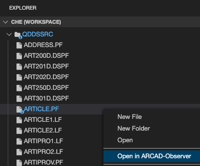
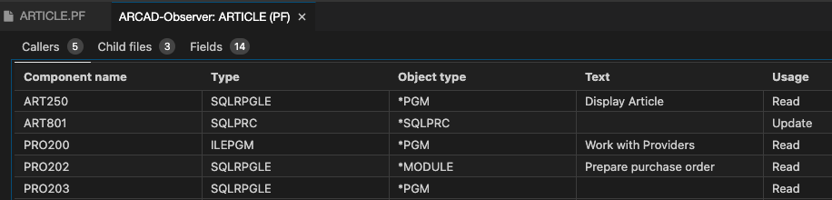
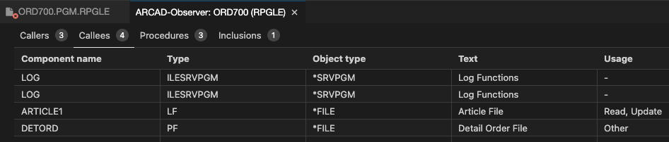
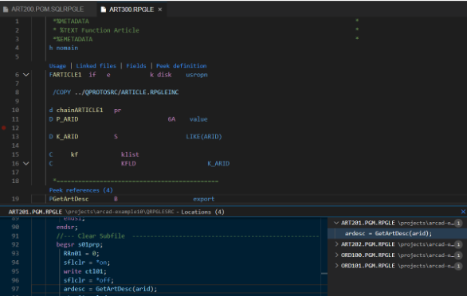

<!-- panels:start -->

<!-- div:left-panel -->

## Explore the Cross reference information (Xrefs)

* Click on the Explorer view icon
* Right-click on `arcad-example/QDDSSRC/ARTICLE.PF` and select `Open in ARCAD-Observer`.  This will open a new Xref panel. Each tab of the panel shows different kinds of Xref information.

Select `Fields` tab

Right-click on `ARID` and select `Open cross references` to see the field cross references.

Right-click on `ARTICLE1` and select `Open` to open the source.

<!-- div:right-panel -->

<!-- panels:end -->
---
<!-- panels:start -->

<!-- div:left-panel -->

* Right-click on `arcad-example/QRPGLESRC/ORD700.PGM.RPGLE` and select the `Open in ARCAD-Observer` to show cross reference information (Callers/Callees/Procedures/Inclusions) for RPG source.

<!-- div:right-panel -->

<!-- panels:end -->
---

<!-- panels:start -->

<!-- div:left-panel -->

**Code Lens**: in-line links directly available while editing (RPGLE) source

* F-Spec level code lens shows same file-level Xref as “Open in Arcad Observer”
* P-Spec “Peek references” allows you to see/browse source of implementing procedure
* Open `arcad-example/QRPGLESRC/FAM300.RPGLE`. The F specs and P specs show code lens links above the line.
* Select `Peek references`

<!-- div:right-panel -->

<!-- panels:end -->