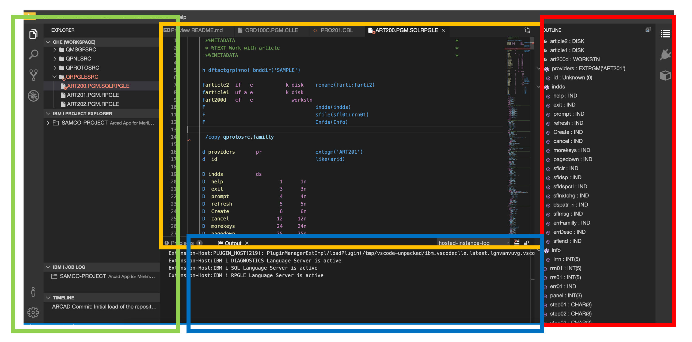
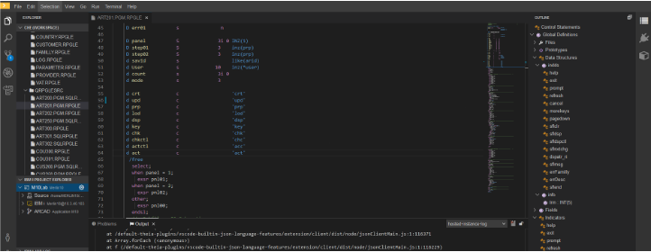
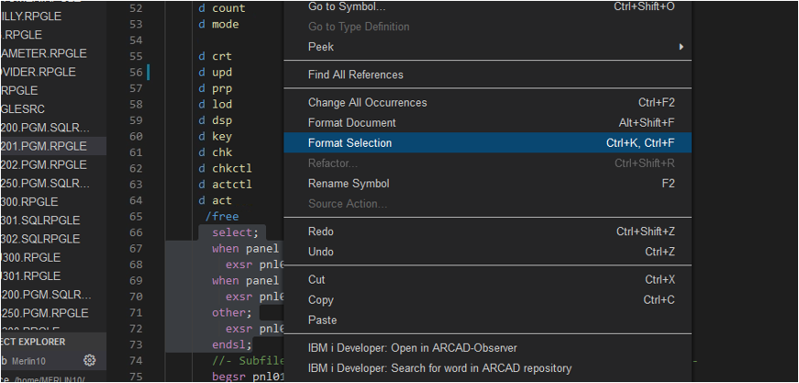
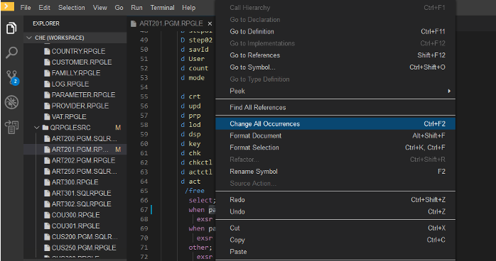
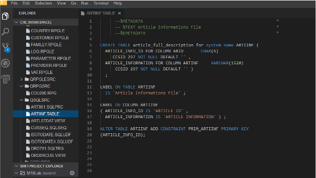

## IDE Workspace

* Green panel: Explorer Panel, file explorer containing  git repository files (source) + other IBM i specific explorers like IBM i Project Explorer, Arcad view, Job Logs…
* Orange panel: central code Panel, where you can visualize and update your source code.
* Red panel:  outline view displays all defined variables, structs and files in active editor
* Blue panel: Problems & Output view, compilation output, warnings, etc.

## ILE RPG 

* Outline – provides structured view of the source code for navigation and supports filtering
* Hover – shows information for item under cursor
* References – show where a particular code element is referenced throughout the workspace
* Definitions – show source of particular code element
* Formatting – format the whole document or a selected region
* Content Assist – code and variable completion
* Rename – intelligently rename all references to variables
* Extract Constant – extract a literal value into a constant
* Source Error Reporting – errors are shown beside the text in the editor and in the Problems view

### Tokenization

---

<!-- panels:start -->

<!-- div:left-panel -->

### Formatting

* Preferences
   * Determine auto formatting
* Select Code
   * Right click to reformat

<!-- div:right-panel -->

<!-- panels:end -->

---

<!-- panels:start -->

<!-- div:left-panel -->

### Refactoring

* Rename a symbol
  * Intelligent - not just find and replace
  * Updates the model 
* Shift+enter to preview
  * Decide to apply or not
* Model updated after refactoring
  * Show fields

<!-- div:right-panel -->

<!-- panels:end -->

---

<!-- panels:start -->

<!-- div:left-panel -->

## SQL

* Tokenization
* Formatting
* Code collapse
* Embedded SQL

<!-- div:right-panel -->

<!-- panels:end -->

---